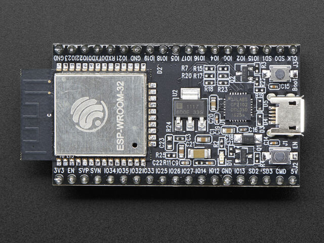

.. _devices_esp32:

Espressif ESP32
===============

The ESP32 is a popular family of WiFi and Bluetooth enabled System-on-Chip
(SoC) by Espressif Systems.

    The Espressif ESP32 Development Board (image attribution: Adafruit).

.. toctree::
    :maxdepth: 1

    install
    specific

Overview
--------

MicroPython supports the ESP32, ESP32S2, ESP32S3, ESP32C2, and ESP32C3 chips,
both with and without external RAM (known as PSRAM or SPIRAM).

ESP32-based boards
~~~~~~~~~~~~~~~~~~

There is a multitude of modules and boards from different sources which carry
ESP32 chips. MicroPython tries to provide a generic port which would run on
as many boards/modules as possible, but there may be limitations. Espressif
development boards are taken as reference for the port (for example, testing is
performed on them).  For any board you are using please make sure you have a
datasheet, schematics and other reference materials so you can look up any
board-specific functions.

MicroPython is implemented on top of the ESP-IDF, Espressif's development
framework for the ESP32.  This is a FreeRTOS based system.  See the
`ESP-IDF Programming Guide <https://docs.espressif.com/projects/esp-idf/en/latest/esp32/index.html>`_
for details.

To make a generic ESP32 port and support as many boards as possible the
following design and implementation decision were made:

* GPIO pin numbering is based on ESP32 chip numbering.  Please have the
  manual/pin diagram of your board at hand to find correspondence between your
  board pins and actual ESP32 pins. Names of pins in this documentation will be
  chip names (eg GPIO2) and it should be straightforward to find which pin this
  corresponds to on your particular board.
* All pins are supported by MicroPython but not all are usable on any given board.
  For example pins that are connected to external SPI flash should not be used,
  and a board may only expose a certain selection of pins.

If your board has a USB connector on it then most likely it is powered through
this when connected to your PC.  Otherwise you will need to power it directly.
Please refer to the documentation for your board for further details.

TODO: USB

Technical specifications and SoC datasheets
~~~~~~~~~~~~~~~~~~~~~~~~~~~~~~~~~~~~~~~~~~~

The datasheets and other reference material for ESP32 chip are available
from the vendor site: https://www.espressif.com/en/support/documents/technical-documents .
They are the primary reference for the chip technical specifications, capabilities,
operating modes, internal functioning, etc.

For your convenience, some of technical specifications are provided below:

* Architecture: Xtensa Dual-Core 32-bit LX6
* CPU frequency: up to 240MHz
* Total RAM available: 528KB (part of it reserved for system)
* BootROM: 448KB
* Internal FlashROM: none
* External FlashROM: code and data, via SPI Flash; usual size 4MB
* GPIO: 34 (GPIOs are multiplexed with other functions, including
  external FlashROM, UART, etc.)
* UART: 3 RX/TX UART (no hardware handshaking), one TX-only UART
* SPI: 4 SPI interfaces (one used for FlashROM)
* I2C: 2 I2C (bitbang implementation available on any pins)
* I2S: 2
* ADC: 12-bit SAR ADC up to 18 channels
* DAC: 2 8-bit DACs
* RMT: 8 channels allowing accurate pulse transmit/receive
* Programming: using BootROM bootloader from UART - due to external FlashROM
  and always-available BootROM bootloader, the ESP32 is not brickable

For more information see the ESP32 datasheet: https://www.espressif.com/sites/default/files/documentation/esp32_datasheet_en.pdf
